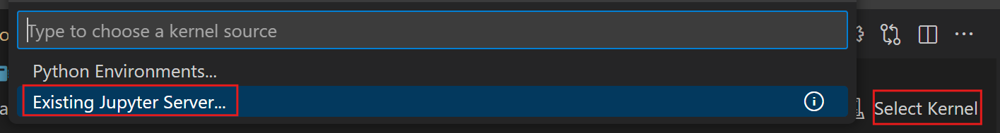

# VirtualDiabetesClinicTriageGrpZ

**Group Z:** Dominic Behling, Filippo Besana, Dominik Eder, Chang Liu

ML microservice that predicts short-term diabetes progression risk using the open scikit-learn diabetes dataset. Includes a fully reproducible MLOps pipeline built with GitHub Actions for training, testing, packaging, and deployment in a portable Docker container. Designed for virtual clinic triage dashboards to prioritize patient follow-ups.

> Based on [MAIO — MLOps](https://github.com/simonhacks/maio-mlops).

## Architecture

```
Your Browser
 ├─ JupyterLab (container :8888) ─ logs runs/artifacts ─┐
 └─ MLflow UI (container :5000)  ◀──────────────────────┤
                                                      
```

---

## Prerequisites

- **Docker Desktop** (Windows/macOS/Linux).
- Git (optional if you download ZIP).
- VSCode (with Jupyter extension optional if you work in a browser)

---

## Repository layout

```
VirtualDiabetesClinicTriageGrpZ/
├─ docker/          # docker files
├─ images/          # images for the documentation
├─ train/           # notebooks & training code
├─ serve/           # Flask/Gunicorn app (API)
└─ docker-compose.yml
```

---

## Quick start

```bash
# 1) Start MLflow + Jupyter
docker compose up -d mlflow notebook

# 2) Open UIs
# MLflow:   http://localhost:5000

# 3) Connect with VSCode on http://localhost:5000
```



## Services & ports

- **MLflow UI**: `http://localhost:5000`
- **JupyterLab**: `http://localhost:8888`

---

## Clean up

```bash
# stop containers
docker compose down

# remove containers + volumes (deletes mlflow DB & artifacts!)
docker compose down -v
```

---
